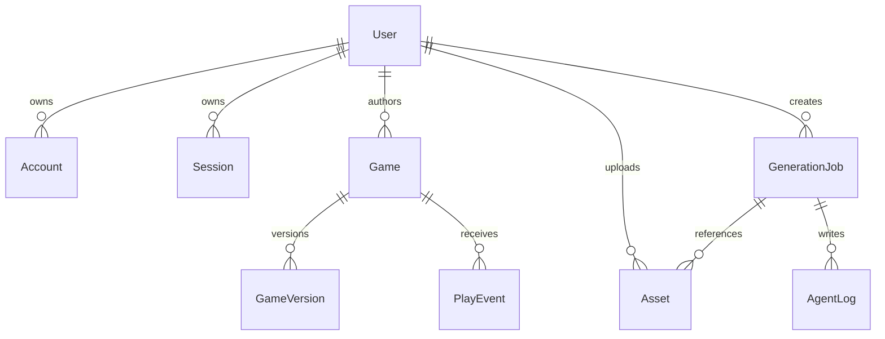

# Data Model

## Core Tables

- `User`: identity, email, username, password hash, avatar.
- `Account`: provider account bindings for credentials and future OAuth.
- `Session`: httpOnly cookie session using a hashed token and expiry.
- `Game`: author-owned game meta, status, counters, tags, and current version pointer.
- `GameVersion`: immutable artifact metadata, manifest URL, storage bucket/prefix, manifest JSON, and build status.
- `Asset`: uploaded user files stored in MinIO and optionally linked to a generation job.
- `GenerationJob`: async Create request state and prompt.
- `AgentLog`: readable per-agent step logs with status and summaries.
- `PlayEvent`: telemetry for load, start, exit, restart, and game-over events.
- `Like` and `Favorite`: social counters and uniqueness constraints.

## Relationships

## Status Fields

- `Game.status`: `draft`, `published`, `archived`.
- `GenerationJob.status`: `pending`, `running`, `succeeded`, `failed`.
- `AgentLog.status`: `running`, `succeeded`, `failed`.
- `GameVersion.buildStatus`: `pending`, `succeeded`, `failed`.

Home queries only `published` games. Create produces draft games first; Publish moves them to the Home surface.
