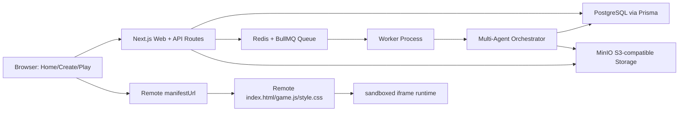
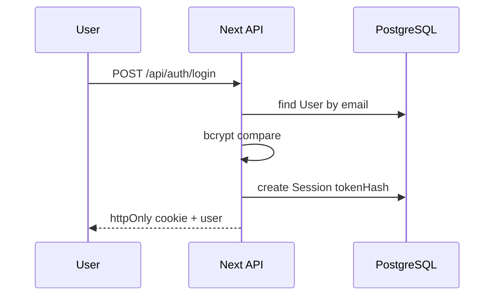
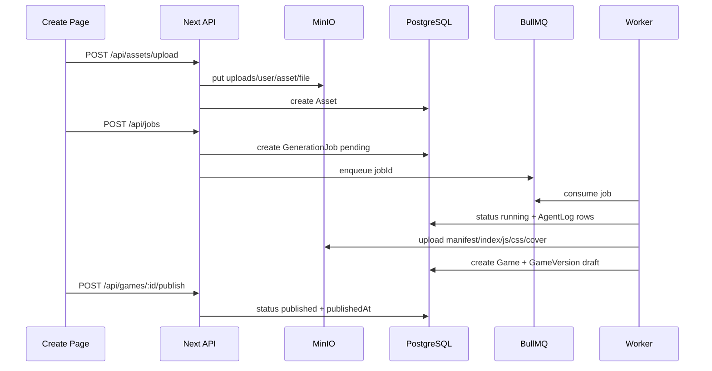
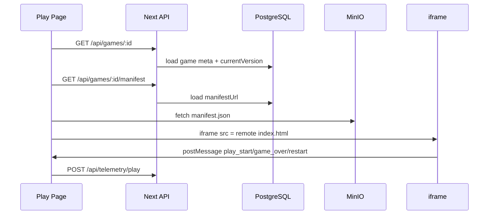

# System Design

## Architecture

## Service Responsibilities

- Web renders App Router pages and owns API boundaries.
- PostgreSQL stores users, sessions, games, versions, assets, jobs, logs, and telemetry.
- Redis/BullMQ decouples the Create request from the generation workflow.
- Worker consumes generation jobs and runs the Agent pipeline.
- MinIO stores uploaded assets and generated game artifacts under S3-compatible keys.
- Play loads database metadata, fetches the remote manifest URL, then runs the remote entry file in an iframe.

## Login Sequence

## Create and Publish Sequence

## Play Sequence

